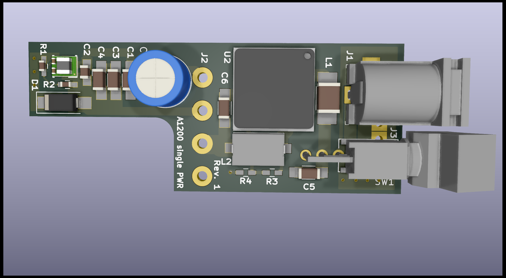
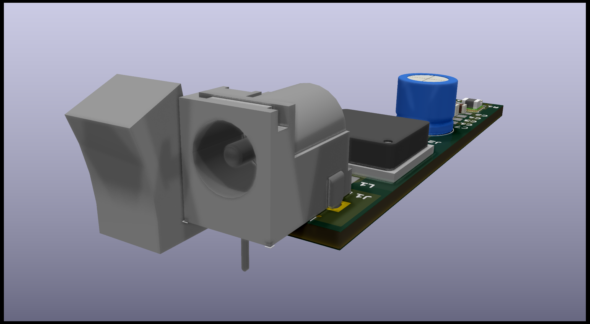

# Amiga1200 single power

This is a DCDC converter Module to fit in Rev. 6a+ Amiga 500 mainboards.
It will be soldered onto the mainboard and one can then use a 12V barrel jack power supply with the Amiga 500.

It can deliver upto 6A @ 5V and 500mA @ -12V. The 12V line is passed through.

It also adds a power switch to the machine on the backside.

This design has not been finally tested yet.

### License
The Amiga1200 single power documentation, including the design itself, is copyright © MastaTabs (Tobias Seiler) 2020.

Amiga1200 single power is Open Hardware licensed under the CERN OHL v. 1.2.

You may redistribute and modify this documentation under the terms of the CERN OHL v.1.2. This documentation is distributed as is and WITHOUT ANY EXPRESS OR IMPLIED WARRANTIES whatsoever with respect to its functionality, operability or use, including, without limitation, any implied warranties OF MERCHANTABILITY, SATISFACTORY QUALITY, FITNESS FOR A PARTICULAR PURPOSE or infringement. We expressly disclaim any liability whatsoever for any direct, indirect, consequential, incidental or special damages, including, without limitation, lost revenues, lost profits, losses resulting from business interruption or loss of data, regardless of the form of action or legal theory under which the liability may be asserted, even if advised of the possibility or likelihood of such damages.

A copy of the full license is included in file LICENSE.pdf, please refer to it for applicable conditions. In order to properly deal with its terms, please see file LICENSE_HOWTO.pdf.

The contact points for information about manufactured Products (see section 4.2) are listed in file PRODUCT.md.

Any modifications made by Licensees (see section 3.4.b) shall be recorded in file CHANGES.md.

The Documentation Location of the original project is https://github.com/MastaTabs/a1200spwr.

